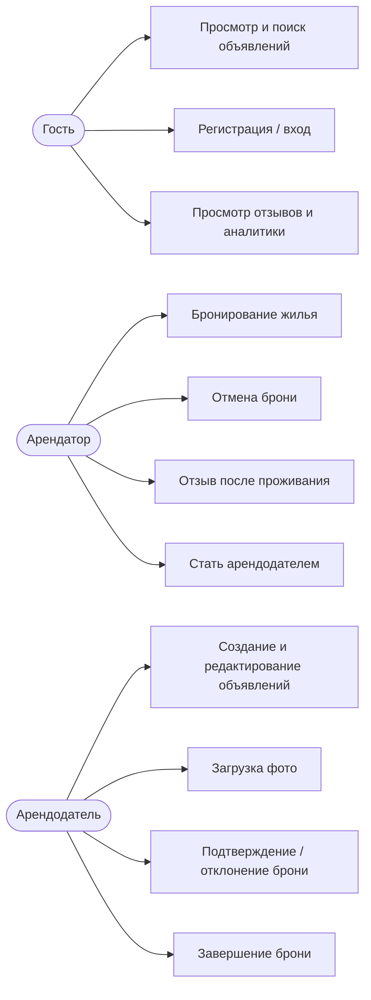
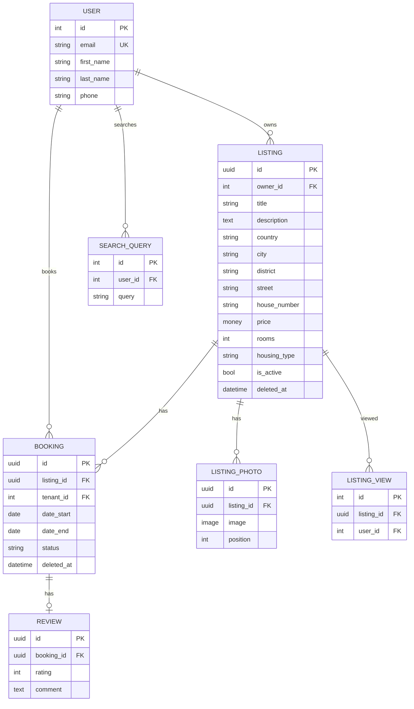
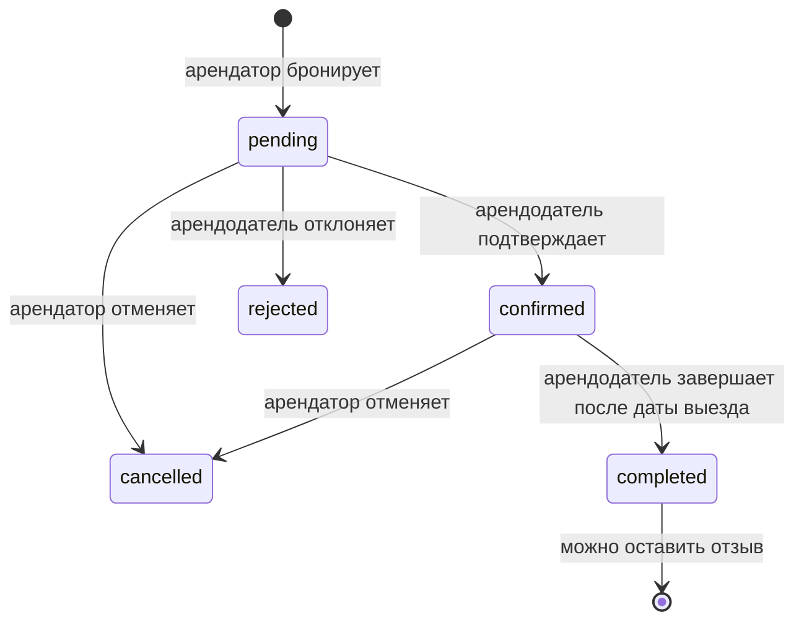
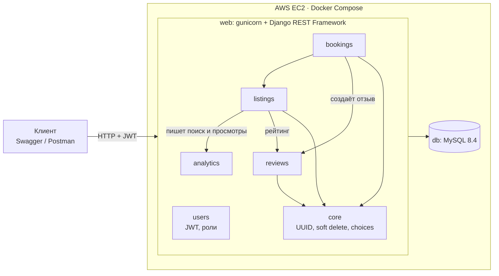

# Rental App

Бэкенд сервиса аренды жилья на Django + Django REST Framework. Арендодатели публикуют объявления, арендаторы ищут жильё, бронируют его и оставляют отзывы после проживания.

**Демо:** http://ec2-13-48-147-74.eu-north-1.compute.amazonaws.com:8000/ (Swagger UI)

## Стек

- Python 3.13, Django 6.1, Django REST Framework
- MySQL 8.4
- JWT-аутентификация (`djangorestframework-simplejwt`, blacklist при logout)
- `django-filter` — фильтрация, `django-money` — цена с валютой, `drf-spectacular` — Swagger
- Docker + Docker Compose, gunicorn, whitenoise
- Деплой: AWS EC2 (Amazon Linux 2023)

## Функционал

- **Объявления:** CRUD, фото, активность (снятие с публикации), soft delete
- **Поиск:** фильтры по цене, комнатам, городу, типу жилья, наличию фото; текстовый поиск; сортировка по цене, дате и рейтингу; статистика цен в ответе пагинации
- **Роли:** арендатор и арендодатель через Django Groups, один пользователь может быть в обеих
- **Бронирование:** проверка пересечения дат с блокировкой строки (`select_for_update`), статусы pending → confirmed → completed, отклонение и отмена
- **Отзывы:** только к своей завершённой брони, один отзыв на бронь; средний рейтинг объявления
- **Аналитика:** популярные поисковые запросы и самые просматриваемые объявления
- Дополнительно: занятые даты объявления, похожие объявления (тот же город, цена ±20%)

## Use Case



## ER-диаграмма

Все модели, кроме `User` и аналитики, используют UUID как первичный ключ и поддерживают soft delete (`deleted_at`).



- `Review` привязан к `Booking` через OneToOne, а не к `Listing`: так отзыв может оставить только тот, кто реально жил в этом жилье, и только один раз.
- `Booking.listing` и `Booking.tenant` — `on_delete=PROTECT`: история бронирований не удаляется вместе с объявлением или пользователем.

## Статусы бронирования



Редактировать и удалять бронь напрямую нельзя (PUT/PATCH/DELETE → 405), статус меняется только через отдельные действия с проверкой прав.

## Архитектура



Стрелка означает «использует»: например, `bookings` проверяет объявление из `listings` и создаёт отзыв в `reviews`.

```
apps/
├── core/       — абстрактные модели (UUID, timestamps, soft delete), менеджеры, choices
├── users/      — User с логином по email, регистрация, профиль, роли, logout
├── listings/   — объявления, фото, фильтры, пагинация, права доступа
├── bookings/   — бронирования и смена статусов, создание отзыва
├── reviews/    — просмотр отзывов
└── analytics/  — история поиска и просмотров
config/         — settings, urls
```

## Роли и права

| Действие | Гость | Арендатор | Арендодатель |
|---|---|---|---|
| Смотреть активные объявления и отзывы | ✅ | ✅ | ✅ |
| Создавать объявления | ❌ | ❌ | ✅ |
| Редактировать / удалять объявление | ❌ | ❌ | только своё |
| Бронировать | ❌ | ✅ (не своё объявление) | ✅ (не своё объявление) |
| Видеть бронирования | ❌ | свои | свои + по своим объявлениям |
| Подтвердить / отклонить / завершить бронь | ❌ | ❌ | только по своим объявлениям |
| Отменить бронь | ❌ | свою | свою |
| Оставить отзыв | ❌ | к своей завершённой брони | к своей завершённой брони |

Новый пользователь автоматически попадает в группу `Tenants` (сигнал `post_save`). Стать арендодателем — `POST /api/users/become-landlord/`.

## API

Полная документация — в Swagger: `/api/docs/`.

| Метод | Эндпоинт | Описание |
|---|---|---|
| POST | `/api/users/register/` | Регистрация |
| POST | `/api/token/`, `/api/token/refresh/` | Вход (JWT), обновление токена |
| POST | `/api/users/logout/` | Выход (refresh-токен в blacklist) |
| GET, PATCH | `/api/users/me/` | Профиль |
| POST | `/api/users/become-landlord/` | Стать арендодателем |
| GET, POST | `/api/listings/` | Список с фильтрами / создание |
| GET, PUT, PATCH, DELETE | `/api/listings/{id}/` | Объявление |
| GET | `/api/listings/{id}/available/` | Занятые даты |
| GET | `/api/listings/{id}/similar/` | Похожие объявления |
| GET, POST | `/api/listings/photos/` | Фото объявлений |
| GET, POST | `/api/bookings/` | Мои бронирования / новая бронь |
| POST | `/api/bookings/{id}/confirm/` `reject/` `complete/` | Действия арендодателя |
| POST | `/api/bookings/{id}/cancel/` | Отмена арендатором |
| POST | `/api/bookings/{id}/review/` | Отзыв |
| GET | `/api/reviews/?listing={id}` | Отзывы объявления |
| GET | `/api/analytics/popular-searches/` | Популярные запросы |
| GET | `/api/analytics/popular-listings/` | Популярные объявления |

Пример фильтрации: `/api/listings/?city=Berlin&min_price=500&max_price=1500&min_rooms=2&ordering=-average_rating`

## Запуск локально

Нужен Docker Desktop.

```bash
git clone https://github.com/Davich02/Final_project.git
cd Final_project
cp .env.example .env        # заполнить SECRET_KEY и пароли БД
docker compose up -d --build
docker compose exec web python manage.py createsuperuser
docker compose exec web python manage.py seed_listings --count=100   # тестовые объявления
```

Приложение: http://localhost:8000/ — миграции и `collectstatic` выполняются при старте контейнера автоматически.

Для разработки с автоперезагрузкой кода можно создать `docker-compose.override.yml` (в git не хранится):

```yaml
services:
  web:
    command: python manage.py runserver 0.0.0.0:8000
```

## Переменные окружения

| Переменная | Описание |
|---|---|
| `SECRET_KEY` | Секретный ключ Django |
| `DEBUG` | `True` локально, `False` на сервере |
| `ALLOWED_HOSTS` | Хосты через запятую |
| `DB_NAME`, `DB_USER`, `DB_PASSWORD`, `DB_ROOT_PASSWORD` | Параметры MySQL |
| `DB_HOST`, `DB_PORT` | `db` и `3306` внутри Docker |

## Тесты

```bash
docker compose exec web python manage.py test
```

28 тестов: регистрация и роли, права доступа к объявлениям и фото, soft delete, валидация и статусы бронирования, рейтинг, фильтр отзывов, аналитика поиска.

## Деплой (AWS EC2)

```bash
ssh -i key.pem ec2-user@<public-dns>
cd Final_project
git pull
docker-compose up -d --build
```

Настройки сервера (`DEBUG=False`, хосты, ключи, пароли) хранятся только в `.env` на сервере. На t3.micro нужен swap (2 ГБ): без него сборка `mysqlclient` исчерпывает память.
